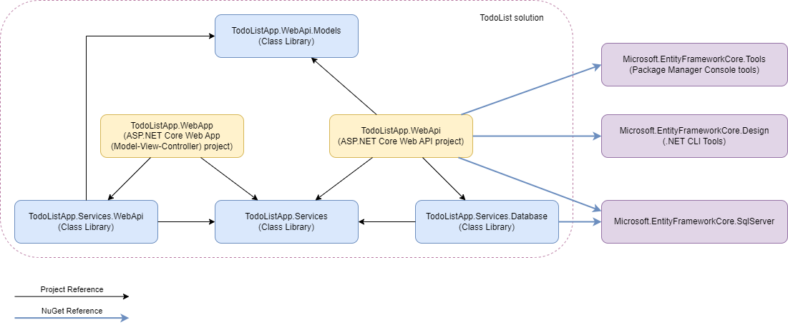
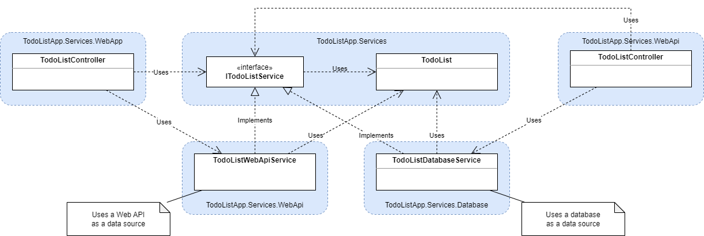
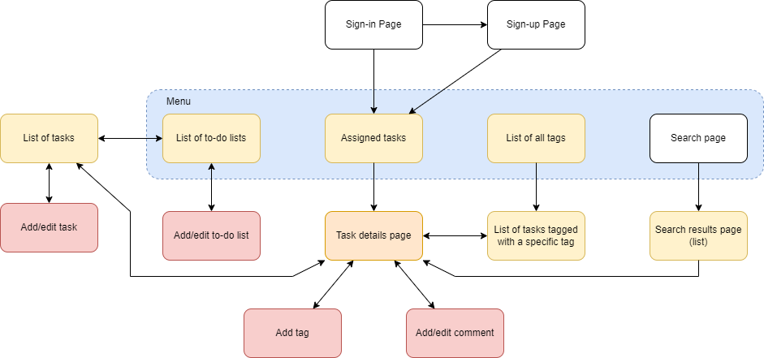

# To-do List Application

## Solution Requirements

This section describes the technical requirements related to the target platform, solution codebase, code quality, etc.


### Target Framework

The C# projects in this solution must target [.NET 6](https://dotnet.microsoft.com/en-us/download/dotnet/6.0). When creating a C# project, ensure that the [target framework moniker](https://learn.microsoft.com/en-us/dotnet/standard/frameworks) is set to `net6.0` in a project file:

```xml
<TargetFramework>net6.0</TargetFramework>
```

If you're having trouble developing .NET 6 applications, make sure you have the .NET SDK 6 installed by running the [dotnet command](https://learn.microsoft.com/en-us/dotnet/core/tools/dotnet) in the console:

```cmd
C:\>dotnet --list-sdks
6.0.408 [C:\Program Files\dotnet\sdk]
```

If you do not have the .NET SDK 6 installed, you can download the installer from the [Download .NET 6.0](https://dotnet.microsoft.com/en-us/download/dotnet/6.0) page.


### C# Projects

The solution must contain two ASP.NET Core applications (*TodoListApp.WebApp* and *TodoListApp.WebApi*) and four class libraries. All C# projects used in this solution must be included in the [TodoListApp.sln](TodoListApp.sln) solution file.

| Component                                                                                            | Template Name                                | Description                                                                                        |
|------------------------------------------------------------------------------------------------------|----------------------------------------------|----------------------------------------------------------------------------------------------------|
| [TodoListApp.WebApp](TodoListApp.WebApp/TodoListApp.WebApp.csproj)                                   | ASP.NET Core Web App (Model-View-Controller) | A web application to provide the end-users with the browser UI.                                    |
| [TodoListApp.WebApi](TodoListApp.WebApi/TodoListApp.WebApi.csproj)                                   | ASP.NET Core Web API                         | A web API application that provides a RESTful API to manage the to-do lists and user's data.       |
| [TodoListApp.WebApi.Models](TodoListApp.WebApi.Models/TodoListApp.WebApi.Models.csproj)              | Class Library                                | A class library for API model classes to share them between the web and web API applications.      |
| [TodoListApp.Services](TodoListApp.Services/TodoListApp.Services.csproj)                             | Class Library                                | A class library for data classes and service interfaces you have to implement.                     |
| [TodoListApp.Services.WebApi](TodoListApp.Services.WebApi/TodoListApp.Services.WebApi.csproj)        | Class Library                                | A class library for service that work with the RESTful API as a data source.                       |
| [TodoListApp.Services.Database](TodoListApp.Services.Database/TodoListApp.Services.Database.csproj)  | Class Library                                | A class library for services that work with the relational database as a data source.              |

The diagram belows shows the dependencies of C# projects in the expected solution.



* The [Microsoft.EntityFrameworkCore.SqlServer](https://www.nuget.org/packages/Microsoft.EntityFrameworkCore.SqlServer/) package contains Entity Framework provider for SQL Server. If you use another database in your project, add a relevant package for your database.
* Add the [Microsoft.EntityFrameworkCore.Tools](https://www.nuget.org/packages/Microsoft.EntityFrameworkCore.Tools) package if you are going to use the [Package Manager Console tools](https://learn.microsoft.com/en-us/ef/core/get-started/overview/install#get-the-package-manager-console-tools) for migrations.
* Add the [Microsoft.EntityFrameworkCore.Design ](https://www.nuget.org/packages/Microsoft.EntityFrameworkCore.Design/) package if you are going to use the [Entity Framework Core tools](https://learn.microsoft.com/en-us/ef/core/get-started/overview/install#get-the-entity-framework-core-tools) for migrations.

The class diagram below is an example of using C# projects to store data classes (TodoList), service interfaces (ITodoListService), and service classes (TodoListWebApiService, TodoListDatabaseService).




### Site Map

The [site map](https://en.wikipedia.org/wiki/Site_map) below shows how a user can navigate throw the application's web starting from the *Sign-in Page*.




### Application Requirements

* Add data validation to your controllers to avoid situations when incorrect input is passed to application services and repositories.
* The endpoints of the web API application must follow the [RESTful API](https://aws.amazon.com/what-is/restful-api/) principles.
* The application must have the right approach implemented for handling application errors:
    * The controller actions must handle exceptions thrown by application services and repositories.
    * The controller action must return a [meaningful status code](https://en.wikipedia.org/wiki/List_of_HTTP_status_codes) when the expected exception is thrown.
    * The controller action must return an "Internal Server Error" status code if an unexpected exception is thrown.
    * The controller action must log events (errors, warnings, and trace messages) using the [ASP.NET Core logging features](https://learn.microsoft.com/en-us/aspnet/core/fundamentals/logging).
* The application must read its configuration settings from the [JSON settings files](https://learn.microsoft.com/en-us/aspnet/core/fundamentals/configuration) using the [JSON configuration provider](https://learn.microsoft.com/en-us/aspnet/core/fundamentals/configuration#json-configuration-provider).
* All the endpoints of an web API application that return a list of data entities must be paginated. You have to decide how to implement pagination for your API.
* The data access layer is a set of repositories that provide CRUD operations for managing data entities.
    * A [repository](https://www.martinfowler.com/eaaCatalog/repository.html) is a class that provides CRUD operations for finding and managing the data entities it is responsible for.
    * The repository methods for each repository must be declared in the appropriate [interface](https://learn.microsoft.com/en-us/dotnet/csharp/language-reference/keywords/interface), which the repository class must implement.
    * Use the [Entity Framework Core](https://learn.microsoft.com/en-us/ef) object-relational mapper to access the database tables; data access should be designed with a *code-first* approach.
    * During application development, use [EF migrations](https://learn.microsoft.com/en-us/ef/core/managing-schemas/migrations) to smoothly evolve your database.
* A web application must have a good-looking browser UI; style your web pages by adding custom [CSS](https://developer.mozilla.org/en-US/docs/Web/CSS).
* When the application is ready, review the application's performance and eliminate all performance issues.


### Authorization & Authentication

* The web application must support user authentication and authorization to allow an application user to manage the only to-do lists and tasks the user has access to. Use the ASP.NET Core Identity API to allow users to create an account on the website.
* The web API application must support the most simple authentication mechanism, protecting the API from being accessed by an unauthorized user. Consider securing your web API application by using the [Bearer Authentication token](https://auth0.com/blog/call-protected-api-in-aspnet-core/)), where the security key is stored in the config file of the web application.


### Code Quality

* The settings in the [.editorconfig](.editorconfig) file are used to configure code style rules. Avoid changing these settings.
    * The [csharp_style_namespace_declarations](https://learn.microsoft.com/en-us/dotnet/fundamentals/code-analysis/style-rules/ide0160-ide0161) parameter is set to `file_scoped`. You may change this setting to `block_scoped` if you prefer having block-scoped namespaces instead of file-scoped.
* The source code must be well organized so that it can be [easily reused](https://en.wikipedia.org/wiki/Code_reuse) by other applications.
* The classes and class methods must have [meaningful names](https://pspdfkit.com/blog/2018/naming-classes-why-it-matters-how-to-do-it-well) that are easy to understand.
* The public classes and interfaces, public constructors, and public methods must be documented; that is, they must have [XML documentation comments](https://learn.microsoft.com/en-us/dotnet/csharp/language-reference/xmldoc/).
* The source code must comply with the [Framework design guidelines](https://learn.microsoft.com/en-us/dotnet/standard/design-guidelines).
* All C# project files in this solution must have the built-in [.NET source code analysis](https://learn.microsoft.com/en-us/dotnet/fundamentals/code-analysis/overview) feature enabled. See the [Code Analysis](https://learn.microsoft.com/en-us/dotnet/fundamentals/code-analysis/overview) documentation section for more details.

```xml
<EnableNETAnalyzers>true</EnableNETAnalyzers>
<AnalysisMode>AllEnabledByDefault</AnalysisMode>
<AnalysisLevel>latest</AnalysisLevel>
<CodeAnalysisTreatWarningsAsErrors>false</CodeAnalysisTreatWarningsAsErrors>
```

* All C# project files in this solution must have the [StyleCop.Analyzers NuGet package](https://www.nuget.org/packages/StyleCop.Analyzers) installed.

```xml
<ItemGroup>
    <AdditionalFiles Include="..\stylecop.json" Link="Properties\stylecop.json" />
</ItemGroup>
<ItemGroup>
    <PackageReference Include="StyleCop.Analyzers" Version="1.1.118">
        <IncludeAssets>runtime; build; native; contentfiles; analyzers; buildtransitive</IncludeAssets>
        <PrivateAssets>all</PrivateAssets>
    </PackageReference>
</ItemGroup>
```

* If you use the Visual Studio, we recommend you install the [SonarLint for Visual Studio 2022](https://marketplace.visualstudio.com/items?itemName=SonarSource.SonarLintforVisualStudio2022) extension. The SonarLint extension detects all Sonar issues, and this would reduce the number of issues in the Quality phase when submitting the task in the AutoCode.


### Git

Here are some recommendation for working with Git:

* The [.gitignore](.gitignore) file is added to this Git repository, which configures Git to ignore files created by the Visual Studio and compilers.
* [Do commit early and often](https://sethrobertson.github.io/GitBestPractices/).
* [Do make useful commit messages](https://sethrobertson.github.io/GitBestPractices/).
* Commit your changes to the *main* branch. You can create Git branches for your code, but only do this if you have enough experience with Git.
* Do not create merge requests in GitLab. We don not use GitLab merge requests to track your progress.
